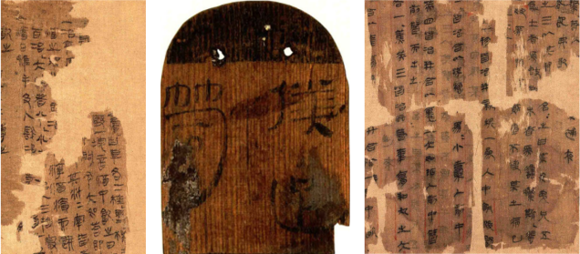
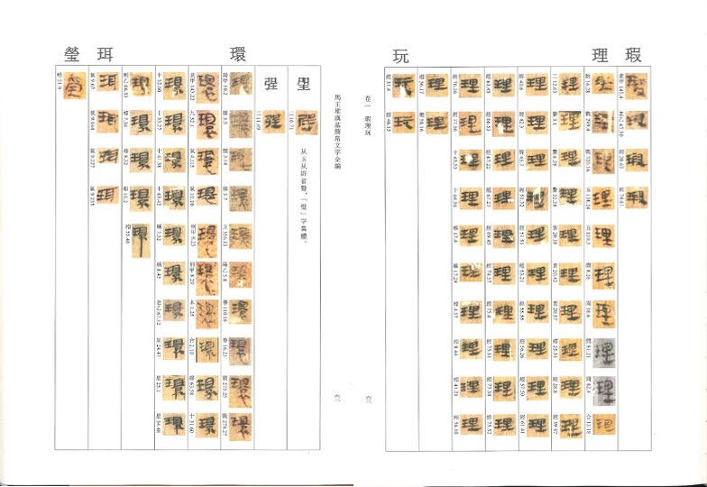
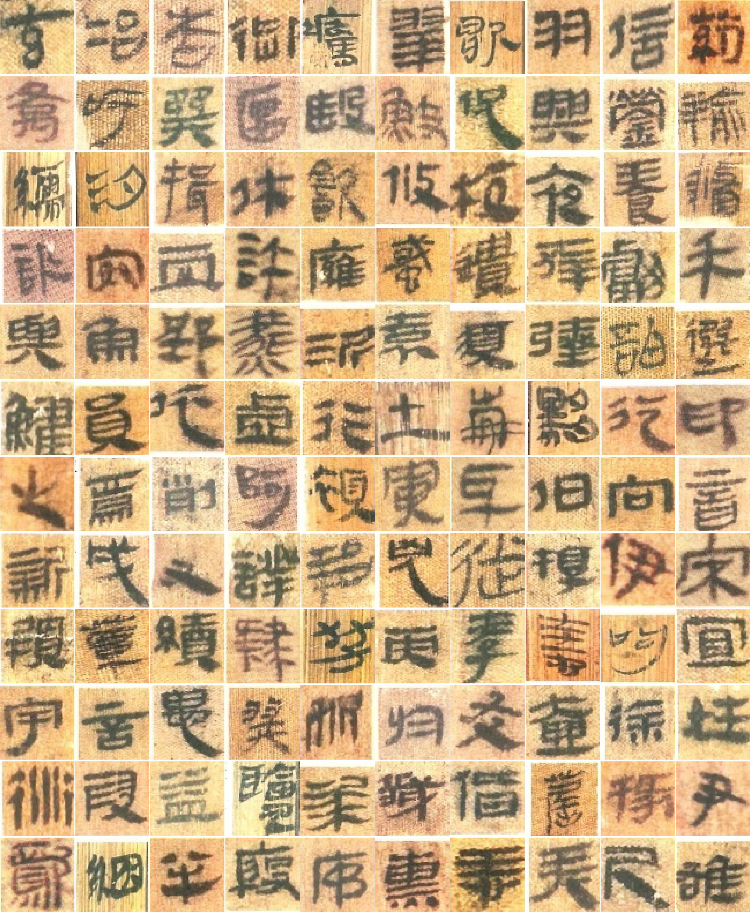

# Mawangdui
## Structure Of This Reop

```shell
Mawangdui:
-character data
    -阿
        -阿_1.jpg
        -阿_2.jpg
    -哀
        -哀_1.jpg
        -哀_2.jpg
    ...
        ...
-code
    -BAGAN_GP
    -Classification
```

## The process for creating this dataset
The wood slips, bamboo slips, and silk manuscripts found in Changsha's Mawangdui Han Tomb had serious problems, including severe damage, the disappearance of text handwriting, corrosion, and darkening of old books.


So "Mawangdui bamboo and silk word the whole series (full 3)" was chosen as the basis for making the dataset.The content pictures are shown below:


Get all single Chinese character images by deep learning method. Finally the final dataset is obtained by manual sorting.


## character data
This folder contains all thef the original dataset.
>All the Handwritten single-word images are from "*Mawangdui bamboo and silk word the whole series (full 3)*" (chinese:《马王堆汉墓简帛文字全编》).
>
>The dataset contains **3339** categories, with a total of **93,841** single-word images.
>
>The category of the dataset is a **Chinese character**, but some Chinese characters do not **exist** now.


## code

Contain two folders, BAGAN_GP and Classification.

### BAGAN_GP

Used to expand the dataset.

The output images is shown below.


> You can visit the [Original Repository](https://github.com/GH920/improved-bagan-gp) for more detailed information.

### Clasiffication

Use sample ResNet and DenseNet to train a Classification model。
